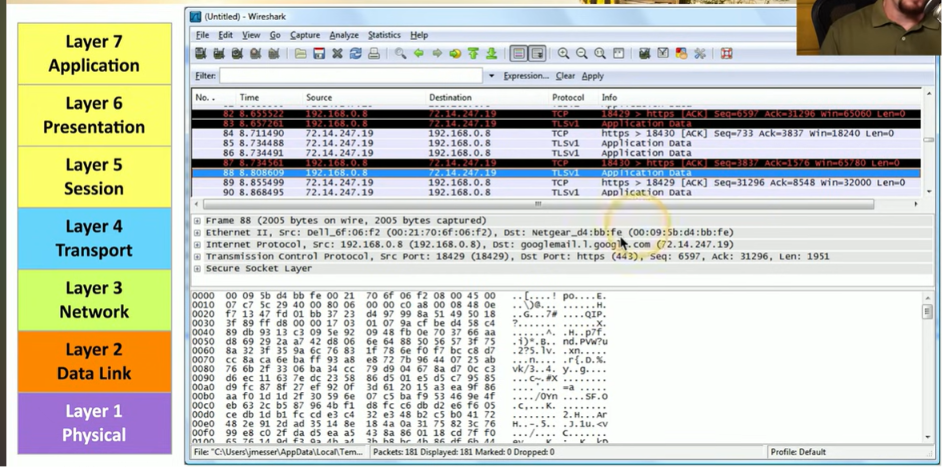
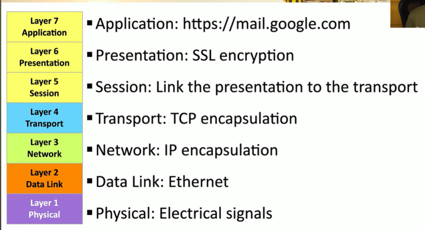

# Day 1/90 Report

## Objective

To understand how a browser communicates with a web server using HTTP and observe real HTTP traffic in Burp Suite.

---

## Topics Covered

- HTTP
- Request & Response
- Headers
- HTTP Methods
- Status Codes
- OSI Model (Application Layer)

---

## Practical Work

- Installed and used Burp Suite
- Opened Burp Browser
- Captured HTTP requests
- Explored HTTP History
- Read PortSwigger HTTP Fundamentals

---

## Observations

- Every webpage generated multiple HTTP requests.
- I found GET requests in HTTP History.
- Each request contained headers like Host, User-Agent and Accept.
- The server replied with status codes such as 200 OK.
- HTTP traffic observed in Burp belongs to the Application Layer (Layer 7) of the OSI Model.

---

## Theory ↔ Practical Connection

Reading about HTTP made more sense after seeing actual requests in Burp Suite.

The OSI Model explained that HTTP works at Layer 7, and Burp allowed me to inspect real Layer 7 communication between the browser and the server.

---

## What I Learned

Today I understood that HTTP is not just a definition—it is the actual communication happening whenever a website loads. Burp Suite helped me visualize requests and responses, making the theory much easier to understand.

---

## Challenges

- Initially understanding all the headers.
- Connecting networking theory with real HTTP traffic.

---

# Burp Suite Observations

## Website Tested

https://portswigger.net

---

## Request Details

Request Method :

Host :

Path :

HTTP Version :

User-Agent :

Accept :

Accept-Encoding :

Accept-Language :

Cookie :

Content-Type : (if present)

Content-Length : (if present)

---

## Response Details

Status Code :

Server :

Content-Type :

Response Length :

Set-Cookie : (if present)

---

